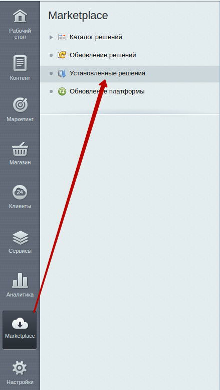
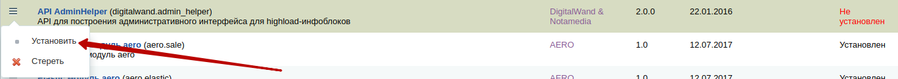
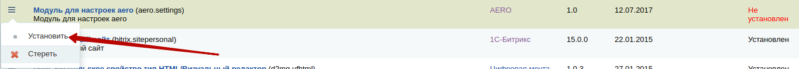

# Установка через Composer

`aero.settings` выложен на [packagist](https://packagist.org/), поэтому, чтобы установить модуль, нужно настроить composer.json, находящийся в корне проекта и добавить

````
"require": {

    "aero/aero.settings": "1.0.*",

  },
````
Composer автоматически скачает нужный пакет, для работы данного решения, а именно [Admin Helper](https://github.com/DigitalWand/digitalwand.admin_helper), благодаря которому строится весь рабочий интерфейс.

Далее остается зайти в `Marketplace -> Установленные решения` для установки.



И установить два решения: `adminhelper` и `aero.settings`.



