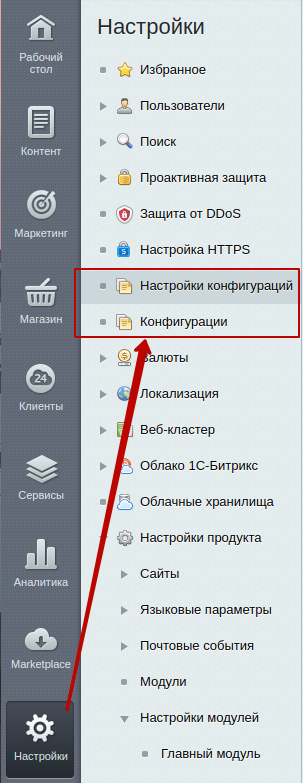
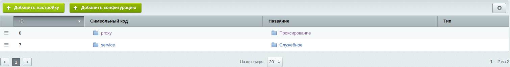
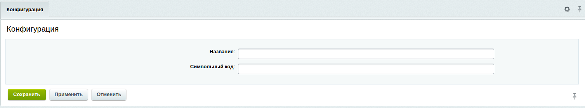
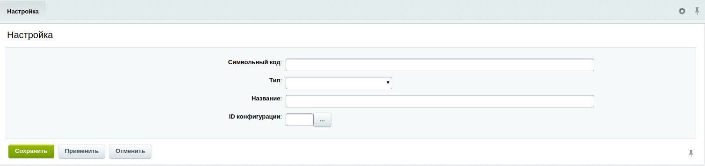
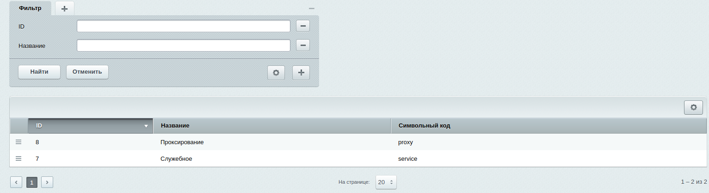
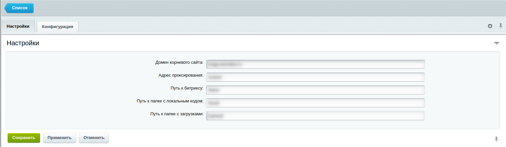

# Работа с модулем

После установки модуля, в разделе "Настройки" административной панели Битрикс появятся два пункта: “Настройки конфигураций” и “Конфигурации”

В настройках конфигураций можно создать новую группу / настройку, или отредактировать текущие.

В конфигурациях хранятся созданные группы настроек, через которые можно редактировать все настройки группы.

